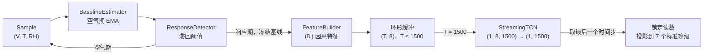

# tcn_refactor

面向逐样本（stream）流式部署的 PdCu 氢气传感器浓度估计：一个严格因果的 TCN，在检测到响应后等待固定
15 秒给出一次浓度等级读数，并同时补偿温度、湿度与基线漂移。

> ⚠️ 目前全部指标来自合成场景数据。生成器未使用真实 PdCu 器件参数，**不是经过实验验证的数字孪生**。
> 指标口径与接入实测数据前必须完成的工作见第 4 节。

## 1. 项目背景

**器件问题**：PdCu 合金氢敏传感器的响应慢——从接触氢气到达稳态通常需要数十秒到分钟级，而到达稳态之前读数
不可信。工程上真正需要的不是"最终能测多准"，而是"什么时候能给出一个可信读数"。

**算法决策**：把浓度判定从"等响应到达稳态"改成"检测到响应后再等固定 15 秒"。判定延迟被钉死在 15 秒左右，
且不依赖"响应是否已到稳态"这个在线无法判定的条件。

**必须同时补偿的三个干扰**：

1. **温度** —— 改变响应速度与灵敏度；
2. **湿度** —— 改变时间常数与灵敏度；
3. **基线漂移** —— 零点本身随环境与时间漂移，不能假设固定基线。

**三条硬约束**（贯穿全部设计，修改代码时不得违反）：

1. **因果性**：时刻 *t* 的输出只能依赖不晚于 *t* 的样本。不允许任何跨时间或跨 batch 的统计归一化，
   不允许读取未来样本。
2. **训练—部署一致性**：训练窗口的起点必须与部署时检测器的实际触发点语义相同；特征必须由同一个
   构造器（`FeatureBuilder` / `build_window`）产生。
3. **可独立验证**：基线估计器与响应检测器不含神经网络，其漏检、延迟与数值行为可以脱离训练单独测试。

**数据现状**：`synthetic.py` 按「随机阀门命令 → 气路延迟与气室混合 → 器件响应 → 基线/漂移/噪声」的
链路逐点生成电压、温湿度与事件真值。器件响应使用带饱和的平方根浓度关系加"快慢双状态"，多次暴露
共享状态，能自然形成不完全恢复与历史依赖。生成器参数是人为设定的，**不含真实 PdCu 器件参数**，
因此它是压力测试与消融平台，而不是数字孪生。

模型结构、训练优化过程与实验演进另见 [`docs/model_optimization.md`](docs/model_optimization.md)，
数据规格见 [`docs/data.md`](docs/data.md)。

## 2. 模型结构

### 2.1 部署链路



四个状态（`SessionState`，实现在 `session.py`）：

| 状态 | 行为 |
|---|---|
| `CALIBRATING` | 收集约 20 s 清洁空气估计初始基线；不检测、不推理、不输出 |
| `IDLE` | 已标定待机；持续监测电压偏离，空气期缓慢更新基线 EMA |
| `RESPONDING` | 检测器触发：记录触发索引、**冻结基线**、清空缓冲、重置特征；逐点积累窗口，未满不输出 |
| `LATCHED` | 窗口收满 1500 点：推理一次、取末端预测并锁定；检测器释放后回到 `IDLE` |

- 检测器不是单点触发：偏离基线 ≥ **8 mV** 并持续 **0.4 s** 判为响应开始；回落到 ≤ **5 mV** 并持续
  **4 s** 判为响应结束（滞回 + 释放延迟，抑制噪声与短时波动）。
- 响应期间基线被冻结，气体响应不会被误吸收进基线。
- 读数只出现一次：进入 `LATCHED` 后重复输入样本仍返回同一个值，直到响应结束。

### 2.2 输入特征（8 通道）

`FeatureBuilder.build_one`（在线逐点）与 `build_window`（离线向量化）必须逐元素一致
（回归测试 `test_window_and_stream_features_are_identical`，`rtol=1e-6`）。第 *t* 个特征只使用
当前及此前样本。

| 通道 | 含义 | 公式（归一化后） |
|---:|---|---|
| 0 | 相对冻结基线的响应幅度 | `(V − baseline) / 0.5` |
| 1 | 原始电压导数 | `ΔV · f_s / 0.05` |
| 2 | 响应累计均值 | `cumsum(V − baseline) / count / 0.5` |
| 3 | 温度 | `(T − 50) / 30` |
| 4 | 湿度 | `(RH − 40) / 40` |
| 5 | 响应进度 | `min(count / 1500, 1)` |
| 6 | 因果平滑斜率 | 2 秒因果均值上的 2 秒差分 |
| 7 | 弱稳态外推先验 | `clip(y_f + 30 · dy_f/dt, −0.5, 2.0)` |

- 通道 6 用"2 秒平滑 + 2 秒差分"而不是逐点差分：逐点差分会让 `τ · dy/dt` 把白噪声放大成主导项。
- 通道 7 只是**网络可以忽略或修正的弱先验**：它不执行浓度标定曲线的反演（没有 `F⁻¹`），也不作为
  输出基线。作用是既不放弃"响应通常具有惯性"这一事实，又不强制 PdCu 服从单一一阶方程——若实际为
  双指数、拉伸指数或带延迟的响应，TCN 可以借其余 7 个通道学会降低该先验的权重。
- 温湿度只做归一化后直接进网，不在特征层手工反演；环境耦合交给网络端到端补偿。

### 2.3 主干与输出层

```text
输入 (B, 8, L)
└─ 6 个因果残差块，通道 32 → 64 → 96 → 96 → 64 → 32
   膨胀率 1, 2, 4, 8, 16, 32；卷积核 k = 15
   每块 = 2 × CausalConv1d + ReLU + Dropout(0.10) + 残差连接
├─ head:         1×1 Conv(32→32) → ReLU → 1×1 Conv(32→1)
└─ context_head: 1×1 Conv(8→16)  → SiLU → 1×1 Conv(16→1)    ← 零初始化
输出 (B, L)，部署时取 [:, -1]
```

四个设计点：

1. **因果卷积**：`Conv1d` 使用内置 padding，前向裁掉右侧多余输出（`model.py:47`）。相比
   `F.pad(x, (left, 0))`，这个写法在消费级 GPU 上仍能走 cuDNN 的大膨胀率卷积快路径。
2. **无归一化层**：`TemporalBlock` 不含 BatchNorm。BN 在训练时统计整段序列，既破坏因果性，也让
   部署时的单样本推理与训练统计不一致。归一化常量（`voltage_ref` 等）固化在特征层，训练与部署读
   同一组值。
3. **`weight_norm`**：把卷积核参数化为"方向 + 幅值"分别优化，对多层膨胀 TCN 通常比直接更新完整
   卷积核更稳定。它只改变参数化方式，不改变形状，也不破坏因果性。
4. **感受野**：`1 + 2(k−1)·Σ2^i = 1 + 2 × 14 × 63 = 1765` 点 ≈ 17.65 s @ 100 Hz，大于 15 s 窗口的
   1500 点，末端输出覆盖完整响应历史（窗口左端之外的 265 点为零填充，训练与部署一致）。
   `train_stream_model` 有硬检查：感受野小于窗口时直接报错。

**`context_head` 的作用**：它是一条从原始特征直达输出的 1×1 卷积分支，负责当前时刻的即时修正
（温度/湿度补偿、响应幅度的局部映射），主干负责时序动态（响应速度、快慢状态、恢复与漂移）。
末层权重与偏置零初始化，使训练初期 `z = z_tcn`，避免浅支路干扰主干梯度。

**输出头**：`langmuir` 模式把网络标量 *s* 映射为单调有界的浓度：

```text
s → clamp(s, ≤ 0.90) → c = ( s / (K(1 − s)) )² ，K = 0.045，上限 1200 ppm
```

单调性保证"投影到 7 个标准等级"时不会出现非物理翻转；occupancy 截到 0.90 让输出有上界。
`eval` 模式下再把连续输出吸附到 7 个标准等级（100/200/400/600/800/1000/1200 ppm），训练时不吸附。

**损失与优化**：log 空间平方损失，只监督窗口最后 300 个时间步，末端时间步再 ×2——前 12 秒的响应
在高湿/低浓度下信息不足，不应强迫模型提前猜浓度。优化器 AdamW（学习率由命令行给定，
`weight_decay=1e-4`），梯度裁剪 `max_norm=1.0`，可选线性 warmup + 余弦退火；每个 epoch 重抽窗口
随机偏移，验证集固定。

### 2.4 与普通离线模型的差异

| 环节 | 普通离线模型 | 本项目 |
|---|---|---|
| 卷积填充 | `padding=k//2` 对称填充，会读到未来 | 左侧填充 + 裁右侧，严格因果 |
| 归一化 | BatchNorm 或整窗 z-score / min-max | 无跨时间、跨 batch 统计；常量归一化固定在特征层 |
| 状态 | 通常无状态，一次吃整段 | 网络无状态（纯函数 `(B,8,L)→(B,L)`）；状态全在 `StreamSession` |
| 输出 | 一次前向一个标量 | 逐时刻输出 `(B, L)`，部署只取末端并锁定 |
| 运行方式 | 每个 batch 一次前向 | 每次检测事件推理一次，随后锁定读数 |

## 3. 使用方式

### 3.1 环境

```bash
uv sync
uv run python -c "import torch; print(torch.__version__, torch.version.cuda, torch.cuda.get_device_name(0))"
```

`torch.version.cuda` 应为非空 CUDA 版本，设备名应为 NVIDIA GPU；只有显式传 `--device cuda` 才会走 GPU。

### 3.2 生成合成数据

```bash
uv run python main.py generate --output data/train_v5.npz   --count 1600 --seed 7026
uv run python main.py generate --output data/val_v5.npz     --count 320  --seed 7027
uv run python main.py generate --output data/test_v5.npz    --count 320  --seed 7028
uv run python main.py generate --output data/holdout_v5.npz --count 320  --seed 8028
```

`--duration-s`（默认 180 s）、`--events`（默认 1）可调；正式训练建议保持 `--events 1`，避免未恢复
残留。NPZ 内同时写入 `generator_version`、`schema_version` 与 `config_json`，读取时会校验。

### 3.3 训练

分两阶段：先以较高学习率训出响应形态，再降低学习率精修。

```bash
uv run python main.py train --data data/train_v5.npz --val-data data/val_v5.npz \
  --checkpoint checkpoints/stream_v5_langmuir_cuda.pt --epochs 50 --lr 1e-4 \
  --warmup-epochs 2 --min-lr 2e-6 --device cuda

uv run python main.py train --data data/train_v5.npz --val-data data/val_v5.npz \
  --checkpoint checkpoints/stream_v5_deployment_cuda.pt --epochs 30 --lr 3e-5 \
  --warmup-epochs 1 --min-lr 1e-6 --device cuda \
  --resume checkpoints/stream_v5_langmuir_cuda.pt
```

- `--resume` 指向**同一个** `--checkpoint` 路径时继承历史最佳 MAPE 门槛；写到**新路径**时只做热启动，
  按新验证分布重新建立门槛。
- 不提供 `--val-data` 时退回按场景 80/20 划分（同一场景不会跨集合），仅适合快速试验。
- checkpoint 在每次验证提升时立刻原子写入，长任务中断不会丢最佳权重。
- 其它可调项：`--batch-size`（默认 32）、`--epochs`（默认 20）、`--lr`（默认 5e-4）、
  `--warmup-epochs`、`--min-lr`（不给则保持固定学习率）。

### 3.4 评估

```bash
# 完整部署路径：逐点回放，跑状态机 + 检测器 + 模型
uv run python main.py replay --data data/holdout_v5.npz \
  --checkpoint checkpoints/stream_v5_deployment_cuda.pt --device cuda

# 已对齐窗口：绕过状态机与检测器，只看模型在窗口上的表现
uv run python main.py window-eval --data data/test_v5.npz \
  --checkpoint checkpoints/stream_v5_deployment_cuda.pt --device cuda
```

`replay` 报告事件数、漏检数、平均检测延迟与最终 MAE/MAPE（可加 `--start` / `--limit` 分段回放）；
`window-eval` 报告 5/10/15 秒 MAPE 与末端 MAE/RMSE。两者口径不同，**必须分开报告**。

### 3.5 作为库使用

```python
from tcn_refactor.domain import Sample
from tcn_refactor.session import StreamSession
from tcn_refactor.training import load_stream_model

model, config = load_stream_model("checkpoints/stream_v5_deployment_cuda.pt", device="cpu")
session = StreamSession(model, config=config, device="cpu")

for voltage, temperature_c, humidity_rh in sensor_stream():      # 逐样本，无 batch
    result = session.push(Sample(voltage, temperature_c, humidity_rh))
    if result.state == "latched":
        print(result.concentration_ppm)    # 同一响应期内重复返回同一读数
```

`push` 返回 `Prediction(state, concentration_ppm, response_samples, detected_event_start)`；
`session.reset()` 清空全部部署状态并重新标定。整个链路是逐样本的，不接受 batch 输入，也不依赖
未来样本。

### 3.6 测试与静态检查

```bash
uv run python -m unittest discover -s tests -v
uv run ruff check .
uv run python -m compileall -q tcn_refactor main.py
```

测试保护以下不变量（共 11 条）：合成场景的事件时刻与气室动力学随机、训练基线只用可观测电压
（不读合成数据的真值基线）、warmup + 余弦学习率到达边界、CUDA 不可用时明确报错、NPZ 往返不依赖
pickle、批量窗口与逐点特征逐元素一致、模型输出因果性、Langmuir 输出恒正、log 损失梯度有限、
每层因果卷积都使用 `weight_norm`、会话在收满窗口后锁定读数。

## 4. 注意事项

### 指标口径与边界

- 独立验证集（`window-eval`）最佳**等级投影** MAPE **8.15%**。
- 开发测试集完整回放（`replay`）：检出 320/320，平均检测延迟 **3.103 s**，MAE **66.929 ppm**，
  MAPE **9.680%**。
- 未参与任何设计决策的确认集回放：检出 320/320，延迟 **3.140 s**，MAE **67.467 ppm**，
  MAPE **9.872%**。
- **两个口径不能混用**：8.15% 是"给定已对齐窗口时模型的单独表现"，9.680% / 9.872% 才是
  "检测器 + 状态机 + 模型"的端到端部署表现。
- 从**事件真值起点**计时的 5 / 10 / 15 秒 MAPE 为 **132.521% / 42.840% / 14.191%**，只有 15 秒
  口径进入 10% 以内。因此只能表述为"检测器触发后等待 15 秒并输出标准等级时误差低于 10%"，
  **不能**表述为"阀门开启后任意 15 秒窗口都低于 10%"。
- 以上数字全部来自**合成场景**，不能外推为任意连续浓度或真实器件精度。

### 接入实测数据前必须完成

- 重新标定 Langmuir 系数 `K` 与七个浓度等级；
- 分别拟合并比较单指数、双指数、拉伸指数等响应形式，确认真实动力学是否超出合成分布；若超出，
  必须扩充生成器，而不是直接复用现有权重；
- 同时报告连续回归与等级投影两套指标；
- 当前生成器的器件级参数只保留短期重复性（同一支已标定传感器、同一气路）；跨器件泛化需要额外
  提供设备标定数据。

### Checkpoint 兼容性

- 每个 checkpoint 带版本门：`feature_version = "weak_prior_v4"`、
  `model_version = "context_langmuir_logmse_v4"`，不匹配会在加载前直接抛错。
- 任何特征语义、通道数或输出头的改动都必须同步提升版本号并从头训练；旧权重即使张量形状能对上
  也不得混用。
- 加载时依赖 checkpoint 内 `payload["model"]` 的结构参数（`input_channels`、`channels`、
  `kernel_size`、`use_context_head`、`quantize_in_eval` 等），改网络结构要保证这些字段一并写入。

### 文档与代码的一处口径差异

汇报稿与设计说明（`docs/huibao.md`、`docs/model_optimization.md` 的相关章节）已按 **7 通道**书写，
即第 7 通道"弱稳态外推"**已停用**；但代码目前仍是 **8 通道**——`model.py` 的 `input_channels`
默认 8、`features.py` 的 `FeatureBuilder` 仍构造 `steady_proxy`、`tests/test_core.py` 的断言也仍是
`(8, L)`。这条改动尚未落地，两种口径的差异会一直存在到收敛为止。

### 旧版结果不可复用

第 2 版生成器的数据分布与第 5 版不兼容。旧权重（`checkpoints/stream_cuda_warmup_cosine.pt`）与旧指标
（验证 7.205%、部署回放 8.000%、检测延迟 2.515 s）只作历史对照，**不得**作为当前模型的评估依据，
也不得与上表数字并列引用。

### 修改代码时不要破坏的不变量

- 不要引入 BatchNorm、时间维 LayerNorm 或任何整窗统计归一化；
- 新特征必须满足 `f_t = f(x_≤t)`，并补上"批量窗口与逐点特征逐元素一致"的回归测试；
- 特征改动后，因果性测试与 `replay` / `window-eval` 双口径指标都要重跑；
- 加长 `response_window_s` 时必须同步加深网络：`train_stream_model` 会检查感受野 ≥ 窗口，不足
  直接报错。

### 已知静态检查告警

`uv run ruff check .` 目前有 9 条既有告警尚未修复：`dataset.py:34`、`features.py:20`、`features.py:98`、
`session.py:26`、`synthetic.py:17` 的 `B008`（默认参数中调用 `SystemConfig()`），以及 `metrics.py:27`
的 `SIM102`（可合并的嵌套 `if`）。
