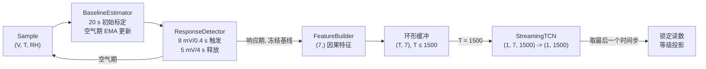
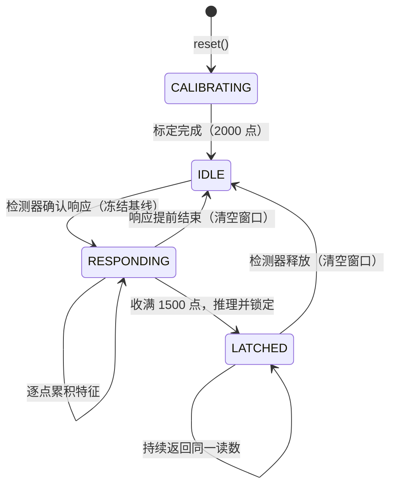

# PdCu 氢气传感器响应加速与温湿度/基线漂移补偿算法

**面向逐样本流式部署的因果 TCN：方法、实验与边界**

> 本稿为学术汇报用稿，包含四部分可直接使用的材料：
> 技术正文（第 1–7 节，第 2 节包含模拟数据的生成与切分说明）、口播讲稿（第 8 节）、
> 预计提问与回答（第 9 节）、复现命令（第 10 节）。
> 汇报建议时长 13 分钟 + 8 分钟提问；配套材料为 `checkpoints/stream_v5_deployment_cuda.pt`
> 与 `docs/model_optimization.md`。

---

## 0. 汇报速览

**一句话**：把 PdCu 氢气传感器的浓度判定从"等响应到达稳态"改成"响应被检测到后再等固定
15 秒"，用一个严格因果的流式 TCN 完成温湿度与基线漂移的联合补偿，在标准浓度等级判定上
把误差压到 10% 以内，并且整个链路可以逐样本、无未来信息地在线运行。（数据为模拟场景，
生成与切分方式见第 2.1、2.4 节。）

**三句话展开**

1. **问题**：传感器响应是多时间尺度的慢过程，电压同时受温度、湿度、基线漂移和噪声影响，
   而工程上需要的是"何时能给出一个可信读数"，不只是"最终能测多准"。
2. **方法**：在线基线标定 + 阈值响应检测确定计时起点，7 通道因果特征，因果 TCN 主干 +
   浅层校准支路，可微 Langmuir 输出层把网络标量映射为单调的浓度，评估时投影到 7 个标准
   浓度等级。
3. **结果**：独立验证集最佳等级投影 MAPE **8.15%**；未参与任何设计决策的确认集完整部署
   回放 **320/320 事件全部检出**，平均检测延迟 **3.140 s**，MAE **67.467 ppm**，
   MAPE **9.872%**。

| 关键数字 | 取值 |
| --- | ---: |
| 采样率 / 响应窗口 / 基线标定 | 100 Hz / 15 s（1500 点）/ 20 s（2000 点） |
| 输入特征 / 模型参数 / 感受野 | 7 通道 / 约 0.84 M / 1765 点（> 1500 点窗口） |
| 数据 | 模拟场景（生成器 v5）：训练 1600 / 验证 320 / 开发测试 320 / 确认 320 条独立记录 |
| 平均检测延迟（从阀门命令计时） | 3.103 s（开发测试）、3.140 s（确认集） |
| 部署回放 MAPE | 9.680%（开发测试）、**9.872%（确认集）** |
| 连续回归 MAPE / 等级投影 MAPE | 12.45% / 8.57%（同一模型、同一验证子集） |
| 回归测试 | 11 项 `unittest` 全部通过 |

---

## 1. 研究背景与问题定义

### 1.1 器件与测量难点

PdCu 合金薄膜氢气传感器通过氢吸收—晶格—电学转导链路把氢浓度转换为电压信号，整条链路
至少包含：气室与管路的气体交换、表面吸附与解离、氢原子向合金晶格溶解、薄膜内扩散、
晶格膨胀与电子散射、测量电路滤波。由此带来五个必须处理的问题：

1. **多时间尺度**：串联过程叠加后响应更接近"快 + 慢"两个状态（或多指数），不是单一
   时间常数的指数响应；上升与恢复的时间常数也不对称。
2. **浓度—响应饱和**：稳态响应随浓度单调但非线性（平方根型饱和），不能假定线性标定。
3. **环境耦合**：温度与湿度同时改变灵敏度和时间常数。
4. **基线漂移**：器件偏置、自然扩散漂移、老化斜率，以及暴露诱导的偏移，都会让"零点"
   随时间缓慢移动。
5. **测量噪声**：毫伏级响应叠加相关低频噪声、异方差白噪声、尖峰和 ADC 量化。

### 1.2 任务定义

同一支已标定传感器、同一套气路的重复测量场景下，浓度从七个标准气体等级中取值：

```text
100、200、400、600、800、1000、1200 ppm
```

模型接收逐样本的 `(电压, 温度, 湿度)`，输出标准浓度等级。部署协议固定为：

> 检测器确认响应开始 → 累计 15 秒因果窗口 → 取窗口最后一个时间步的预测并锁定 →
> 响应结束（含短脉冲后的恢复段）后回到待机，准备下一次检测。

### 1.3 三条硬约束（贯穿全部设计）

1. **因果性**：时刻 *t* 的输出只能依赖不晚于 *t* 的样本，不允许任何跨时间或跨 batch 的
   统计归一化，也不允许使用未来样本。
2. **训练—部署一致性**：训练窗口的起点必须与部署时检测器的实际触发点语义相同，特征必须
   由同一个构造器产生。
3. **可独立验证**：响应检测器与基线估计器不含神经网络，其漏检、延迟与数值行为可以脱离
   PyTorch 单独测试和单独报告。

---

## 2. 数据与实验口径

### 2.1 数据生成：从阀门命令到传感器电压

每个场景（一条 180 秒、100 Hz 的记录）由独立随机种子驱动，逐点生成电压、温度、湿度，并
保存每次暴露的事件真值。生成链路分五步：

**第 1 步 环境**：温度由随机初值（15–65 ℃）、缓慢正弦变化和随机游走叠加；湿度围绕初值
（10–85 %RH）与温度反向耦合（近似恒定绝对含水量），再叠加独立的通风扰动，并裁剪到
`[0, 100] %RH`。

**第 2 步 阀门命令与事件**：首次暴露在标定结束后的可用区间内随机出现，之后的空气间隔在
5–45 秒之间随机抽取，避免出现固定位置特征。暴露时长分三类：**短脉冲**（0.5–0.95 × 15 秒，
约占 12 %）、**常规暴露**（20–55 秒，约 68 %）、**长暴露**（55–90 秒，约 20 %）。设定浓度
从七个标准等级中抽取，并叠加 ±3 % 的随机偏差。

**第 3 步 气路与气室**：阀门命令先经过 0.3–0.8 秒的管路纯延迟，再通过时间常数为 0.8–1.4 秒
的一阶气室混合，得到真正到达传感器表面的逐点浓度。事件起点、表面浓度起点与检测器触发点
因此互不相同。

**第 4 步 器件响应**：每个场景抽取一组固定的虚拟器件参数（场景内不变，事件之间只通过连续
状态与环境变化产生差异）：最大响应 0.52（仅保留 0.3 % 量级的重复性误差）、Langmuir 系数
0.045、基础时间常数 30 秒，以及温湿度灵敏度系数。响应由"平方根 Langmuir 饱和 + 快慢双状态"
构成：快状态时间常数为 τ，慢状态为 3τ，按 0.30 / 0.70 混合；τ 随温度、湿度、浓度变化，
恢复段再乘 1.5 倍——因此上升与恢复不对称，多次暴露共享同一状态，会自然产生不完全恢复与
历史依赖。

**第 5 步 基线、噪声与量化**：基线 = 器件偏置 + 温湿度项 + 交互项 + 随机游走漂移 + 老化
斜率 + 暴露诱导偏移；电压噪声 = AR(1) 相关低频噪声 + 随响应幅度增大的异方差白噪声 +
偶发尖峰（概率 2×10⁻⁵–2×10⁻⁴，幅度 20 mV）+ ADC 量化（步长 0.2 / 0.5 / 1.0 mV）。温度与
湿度再加观测噪声后保存。

生成器版本为 `calibrated_stateful_v5`（schema v2）。**它没有使用真实 PdCu 器件参数，因此
不是经过实验验证的数字孪生**；它的作用是在真值已知的条件下，检验方法能否处理多时间尺度、
浓度饱和、温湿度耦合、基线漂移与测量噪声。所有精度指标都必须带着这一前提阅读。

### 2.2 数据规格

| 项目 | 规格 |
| --- | --- |
| 采样率 | 100 Hz |
| 单条记录长度 | 180 s（18000 点） |
| 同步通道 | 电压 (V)、温度 (℃)、湿度 (%RH)，逐点对齐 |
| 事件标注 | 每次暴露的起止索引与设定浓度等级 |
| 暴露形态 | 短脉冲、常规暴露、长暴露三类；短脉冲约占 12% |
| 温湿度 | 记录内包含缓慢变化与通风扰动，温湿度与响应耦合 |

事件标注描述的是**阀门命令**的起止，它不等于传感器感受到气体的时刻：中间还有气路纯延迟
与气室混合，因此标注起点、表面浓度起点与检测器触发点三者不同。这一点正是第 2.5 节两个
指标口径必须分开的原因。

### 2.3 数据划分与实验纪律

| 子集 | 记录数 | 用途 |
| --- | ---: | --- |
| 训练集 | 1600 | 参数学习（检测对齐窗口 1598 个） |
| 验证集 | 320 | 每轮验证、选择最佳 checkpoint（检测对齐窗口 320 个） |
| 开发测试集 | 320 | 端到端回放指标（曾用于定位短脉冲训练缺口） |
| 确认集 | 320 | 模型固定后单独回放一次，未参与任何设计决策 |

三条纪律：

- 训练、验证、测试、确认使用**相互独立**的数据文件与划分，绝不交叉；
- checkpoint 选择只看验证集，测试集不参与任何超参数选择；
- 开发测试集一旦被用于定位问题，其数字只能作为"开发测试"报告，因此额外保留了一个
  完全未参与决策的确认集，两者分开报告（9.680% vs 9.872%）。

### 2.4 从场景到训练窗口：切分与使用

训练并不直接把整条场景交给模型，而是先在场景内切出与部署同构的窗口：

1. **四份独立划分**：训练 1600、验证 320、开发测试 320、确认 320 条记录，分别用
   `seed = 7026 / 7027 / 7028 / 8028` 生成，文件相互独立、绝不交叉。
2. **窗口起点由部署侧检测器决定**：`StreamWindowDataset(alignment="detection")` 先逐点运行
   部署用的 `BaselineEstimator` 与 `ResponseDetector`，在检测器触发时**冻结可观测基线**，
   再从触发点截取 15 秒（1500 点）因果窗口；特征由与部署完全相同的构造器产生。
3. **标签只来自事件真值**：真实基线、逐点真实浓度与事件起止都不进入特征，它们只用于提供
   浓度标签和事后计算指标。
4. **窗口数量**：训练 / 验证窗口数由 1388 / 281（修复前，要求检测后阀门仍持续开启满 15 秒）
   增加到 1598 / 320（修复后，只要求场景剩余长度 ≥ 15 秒），约 12 % 的短脉冲及其恢复段
   由此进入训练。
5. **评估时的三种用法**：`window-eval` 用事件真值对齐窗口做理想口径比较；`replay` 把整条
   场景逐点送入 `StreamSession`，事件真值只在事后用于匹配检测与计算误差；确认集在模型固定
   之后只回放一次。

### 2.5 两个指标口径（报告中不得混用）

| 口径 | 计时起点 | 含义 | 结果 |
| --- | --- | --- | --- |
| 事件对齐窗口 | 阀门命令时刻 | 含气路延迟与气室混合的"理想窗口"，用于观察模型随时间收敛 | 5 s 132.521% / 10 s 42.840% / 15 s 14.191% |
| 部署回放 | 检测器实际触发时刻 | 与训练窗口语义一致，等价于真实使用方式 | 开发测试 9.680%，确认集 9.872% |

准确的性能表述是：

> **在因果检测器触发后等待 15 秒并输出七个标准浓度等级时**，完整部署回放的 MAPE 在开发
> 测试集为 9.680%，在未参与决策的确认集为 9.872%。

不能表述为"阀门开启后任意 15 秒窗口都低于 10%"——从命令起点计时的 15 秒窗口 MAPE 为
14.191%，因为其中包含了气体尚未到达、检测器尚未触发的阶段。

---

## 3. 系统总体结构

### 3.1 单样本数据流



一次 `push(sample)` 的全部计算量为：常数级状态更新 + 一次 8 维特征构造；只有窗口收满时才
执行一次完整前向。模型不做任何增量状态缓存，使用固定长度环形缓冲，内存上界为
7 × 1500 个 float32。

### 3.2 部署状态机



状态机是本系统"加速"语义的载体：

- **CALIBRATING**：只采集清洁空气样本估计初始基线，不检测、不推理、不输出；
- **RESPONDING**：基线被冻结，逐点构造特征，模型尚不输出；
- **LATCHED**：窗口收满后只推理一次，读数被锁定，同一响应期内重复返回同一值——避免在
  响应尚未充分发展时反复给出抖动读数；
- 响应被释放后回到 **IDLE**，准备下一次检测。短脉冲在阀门关闭后仍处于缓慢恢复段，
  因此仍能收满 15 秒窗口并给出读数。

---

## 4. 方法

### 4.1 在线基线与响应检测

**基线估计器**：先用 20 秒（2000 点）的观测电压均值完成初始标定；之后仅在被判定为空气
期的样本上以 30 秒时间常数做指数滑动平均（EMA）。进入响应状态后基线被**冻结**，防止把
气体响应本身吸收进基线。

**响应检测器**：对电压做 0.8 秒因果移动平均后与基线比较，

- 偏离 ≥ **8 mV** 并持续 **0.4 s** → 判定响应开始；
- 偏离 ≤ **5 mV** 并持续 **4 s** → 判定响应结束（滞回 + 释放延迟，抑制噪声与短时波动）。

该检测器不含学习参数，因此它的漏检率与延迟可以脱离模型单独测量、单独报告，也便于在
不同气路条件下重新整定阈值。

### 4.2 七通道因果特征

特征形状 `(7, L)`，训练与部署共用同一个构造器 `FeatureBuilder` / `build_window`：

| 通道 | 含义 | 公式（归一化后） |
| ---: | --- | --- |
| 0 | 相对冻结基线的响应幅度 | `(V - baseline) / 0.5` |
| 1 | 原始电压导数 | `ΔV · f_s / 0.05` |
| 2 | 响应累计均值 | `mean(V[0:t] - baseline) / 0.5` |
| 3 | 温度 | `(T - 50) / 30` |
| 4 | 湿度 | `(RH - 40) / 40` |
| 5 | 响应进度 | `min(已响应点数 / 1500, 1)` |
| 6 | 因果平滑斜率 | 2 秒因果均值上的 2 秒差分 |

设计要点：

- **第 5、6 通道的尺度是刻意选的**。早期版本使用 0.5 秒平滑与 0.5 秒差分，结果毫伏级
  白噪声被 `τ · dy/dt` 放大；改为 2 秒平滑 + 2 秒差分后，斜率通道的信噪比显著改善。
- **温湿度显式归一化**：温度与湿度各自归一化后直接进入网络，不在特征层做手工反演，环境
  耦合交由网络端到端补偿。
- **早期版本的弱稳态外推通道（`clip(y_f + 30 · dy_f/dt, -0.5, 2.0)`）已停用**，不再作为
  模型输入。它曾用于把一阶动力学假设降级为可被忽略的先验，但该假设在实测数据上并未得到
  确认，保留它只会引入一个不可验证的偏置来源；当前模型只使用可观测通道。
- **所有通道严格因果**：第 *t* 个特征只使用当前及此前样本；批量训练与逐点部署由回归测试
  保证逐元素一致（`rtol=1e-6`）。

### 4.3 因果 TCN 主干与浅层校准支路

**主干**（6 个因果残差块）：

```text
输入通道 7
隐藏通道 32 → 64 → 96 → 96 → 64 → 32
卷积核 15，膨胀率 1、2、4、8、16、32
每块 = 两层因果卷积 + ReLU + Dropout(0.10) + 残差连接
```

- 因果卷积的实现方式是在 `Conv1d` 内部 padding 后裁掉右侧多余输出，这样在消费级 GPU 上
  仍能走 cuDNN 的大膨胀率卷积路径。
- 每层卷积使用 `weight_norm`（方向 + 幅值分别优化），只改变参数化方式，不改变形状，也不
  破坏因果性。
- **不使用 BatchNorm 或任何跨时间统计的归一化层**——它们在训练时会统计整段时间序列，
  破坏"只用过去样本"的一致性。
- 感受野 `1 + 2·(k-1)·Σ2^i = 1765` 点，大于 15 秒窗口的 1500 点，末端输出能覆盖完整
  响应历史；训练时若感受野小于窗口会直接报错。
- 参数约 0.84 M（float32 checkpoint 3.2 MB）。

**浅层校准支路**（context head）：

```text
(B, 7, L) → 1×1 Conv(7→16) → SiLU → 1×1 Conv(16→1)
```

两条支路的原始输出相加：`z = z_TCN + z_context`。分工是：深层 TCN 学延迟、快慢动态与
历史形状；浅层支路直接利用当前时刻的响应幅度、温湿度与稳态代理特征，学习即时的环境修正。
浅层支路最后一层零初始化，因此引入时**不会改变**原 TCN 的初始预测，也不会在训练初期干扰
主干梯度。

### 4.4 单调输出层与标准等级投影

输出层把网络标量 `z` 映射为浓度，物理含义是 Langmuir 占据率：

```text
s = clamp(sigmoid(z), max=0.90)
sqrt(c) = s / (K · (1 - s)),  K = 0.045
c = [s / (K · (1 - s))]²
```

相比直接 `sigmoid × 1200`（边界饱和）或 `softplus × 200`（需要网络自行学出整条饱和曲线），
该参数化把"单调饱和"这一物理事实写进结构：

- 训练期间变换连续可微，梯度可正常回传；
- 输出恒为正，并允许表达高浓度；
- 它只保证 `z → c` 单调，并不约束"特征 → z"的映射，所以不限制动力学形状；
- 头部偏置初始化为约 600 ppm 对应的占据率，避免初始化落入极低浓度区。

**标准等级投影**：训练保持连续输出以保留梯度；切换到 `eval()` 或部署状态后，连续结果投影
到最近的标定等级。这是"标准气体等级识别"任务的正确口径，也是 8.57% 与 12.45% 差异的来源
（见 5.3）。如需连续测量，应关闭 `quantize_in_eval` 并重新标定。

### 4.5 损失函数与优化

**对数浓度均方损失**：

```text
e(t) = log(max(pred(t), 1)) - log(max(target, 1))
loss = mean(e², 最后 3 秒) + 2 × e²(最终时刻)
```

三点设计动机：

1. 对数误差在小误差区间近似相对误差，使低浓度与高浓度在相近的相对尺度上优化；
2. 平方项为远离中位数的浓度等级提供比 L1 更强的纠偏梯度——早期相对 Huber 在误差较大时
   近似 L1，模型接近中位浓度时不同批次梯度相互抵消，出现振荡；
3. 只监督窗口末段（最后 3 秒 + 末端加权 2 倍），与"15 秒时锁定读数"的部署行为一致，
   不强迫模型在响应尚不可辨识的前 12 秒猜出浓度。

**优化配置**：

| 项目 | 设置 |
| --- | --- |
| 优化器 | AdamW，权重衰减 1e-4 |
| 梯度裁剪 | `max_norm = 1.0` |
| 学习率调度 | 线性 warmup（从峰值 10% 起步）+ 余弦退火 |
| 基础训练 | 50 轮，峰值 1e-4 → 最低 2e-6，warmup 2 轮 |
| 部署对齐微调 | 30 轮，峰值 3e-5 → 最低 1e-6，warmup 1 轮，从基础阶段热启动 |
| checkpoint 选择 | 每轮验证，按**等级投影后**的验证 MAPE 保存最优 |
| 可复现性 | 固定随机种子；权重原子写入，长任务中断不丢最佳结果 |

### 4.6 训练—部署一致性

这是本项目最关键的一次方法修正。早期训练窗口从**事件标注起点**截取，部署却从**检测器触发
点**计时；慢响应传感器中，未知的几秒偏移会与浓度幅值相互混淆，造成明显的训练—部署分布
差异。

修正后，训练数据集的窗口构造直接复用部署侧的 `BaselineEstimator` 与 `ResponseDetector`：

1. 仅用历史电压完成清洁空气基线标定；
2. 逐点运行响应检测器；
3. 在检测器实际触发时冻结可观测基线；
4. 从触发点截取 15 秒因果窗口；
5. 事件标注只用于提供训练标签，不参与触发判定。

另一个同源问题是**短脉冲被排除**：旧构造器要求"检测后阀门仍持续开启满 15 秒"，而部署状态
机在阀门关闭后的恢复段仍能收满窗口并输出读数。修复为"仅要求场景剩余长度 ≥ 15 秒"后，
训练/验证窗口数由 1388/281 增加到 **1598/320**，短脉冲及其恢复段全部进入训练，这也是
部署回放 MAPE 从 11.536% 降到 9.680% 的直接原因。

模型侧的对应保证：checkpoint 中显式写入 `feature_version = weak_prior_v4` 与
`model_version = context_langmuir_logmse_v4`，特征或输出头语义变化时拒绝续训——避免张量
形状相同但语义不同导致的静默错误。

---

## 5. 实验结果

### 5.1 主结果

**验证集（检测对齐，320 个窗口）**

| 指标 | 结果 |
| --- | ---: |
| 最佳等级投影 MAPE | **8.15%** |

**独立确认集完整部署回放（320 条记录 / 320 个暴露事件）**

| 指标 | 结果 |
| --- | ---: |
| 检出事件 | **320/320** |
| 漏检 | 0 |
| 平均检测延迟 | **3.140 s** |
| 最终 MAE | **67.467 ppm** |
| 部署回放 MAPE | **9.872%** |

**开发测试集完整部署回放**：320/320 检出，平均检测延迟 3.103 s，MAE 66.929 ppm，
MAPE 9.680%。

时间上可以这样解释：检测器在阀门命令后平均约 3.1 秒确认响应，再累计 15 秒窗口，因此
"从命令到给出锁定等级"的等效判定时间约为 18 秒，而不是等响应完全到达稳态。

### 5.2 收敛过程：为什么必须等 15 秒

事件对齐窗口上的 MAPE 随响应时间的变化：

| 时刻 | MAPE |
| ---: | ---: |
| 5 s | 132.521% |
| 10 s | 42.840% |
| 15 s | 14.191% |

前 5 秒模型几乎无法判定浓度：这段窗口里气体可能尚未到达传感器表面，或响应幅度仍在噪声
量级，信息量本身不足。到 15 秒时误差进入可用区间。这条曲线同时解释了：
**为什么损失只监督窗口末段**，以及**为什么部署协议是"检测后固定 15 秒"**——这是精度与
响应速度之间的折中，而不是任意选的数字。

### 5.3 连续回归与等级投影

同一模型（短脉冲修复前的长事件验证子集）：

| 输出口径 | MAPE |
| --- | ---: |
| 连续回归 | 12.45% |
| 标准等级投影 | **8.57%** |

结论：模型对连续浓度的估计误差明显大于等级判定误差；报告 10% 以内的精度时，必须同时
声明"投影到七个标准等级"这一前提。

### 5.4 实验演进与关键问题定位

| 阶段 | 主要变化 | 验证 MAPE | 部署回放 MAPE |
| --- | --- | ---: | ---: |
| 初版 | 训练窗口与部署起点错位；器件差异未限定 | 56.925% | 54.732% |
| 检测对齐 + 浅层校准支路 | 复用部署检测器构造窗口；新增 context head | 12.68% | — |
| 对数均方损失 | 替代相对 Huber | 12.50% | — |
| Langmuir 连续输出 | 单调物理输出层 | 12.45%（连续） | — |
| 标准等级投影 | `eval` 时投影到七个标定等级 | 8.57%（投影） | 11.536% |
| 部署对齐微调 | 纳入短脉冲与恢复段窗口 | **8.15%（投影）** | **9.680%** |
| 独立确认 | 固定模型，仅换用未参与决策的确认集 | 不适用 | **9.872%** |

两点必须说明：

- 该表同时改变了任务定义、数据分布、模型与训练过程，**不是严格的单变量消融**，因此不能
  把 56.925% → 9.872% 的改善全部归因于网络结构。最主要的变化是把任务**限定为同一支已
  标定传感器**：早期数据混合了器件级差异，同一电压曲线可能对应"低灵敏度 + 高浓度"或
  "高灵敏度 + 低浓度"，输入端没有任何信息可以区分，这类歧义无法通过增大网络参数量消除。
  跨器件泛化应改为通过显式标定数据或设备条件特征解决，而不是靠隐式学习。
- 表中最后一个数字来自一个**未参与任何设计决策**的确认集，这是本结果可信度的主要依据。

### 5.5 工程验证

| 检查项 | 结果 |
| --- | --- |
| `unittest` 回归测试 | 11 项全部通过（实测 `Ran 11 tests ... OK`） |
| 输出因果性 | 修改第 11 个样本之后的数据，前 11 个预测逐位严格不变（`atol=0`） |
| 批量/逐点特征等价 | `build_window` 与 `FeatureBuilder.build_one` 一致（`rtol=1e-6`） |
| `weight_norm` 覆盖 | 每个残差块的两层卷积均已参数化 |
| 安全数据加载 | `allow_pickle=False`，不依赖对象反序列化 |
| 状态机 | 完成标定 → 检测 → 收满窗口 → 锁定读数全链路有测试覆盖 |
| 环境检查 | `configure_cuda_for_causal_tcn` 在无 GPU 时显式失败而非静默回退 |

---

## 6. 结论与创新点

1. **任务层面**：把"传感器能测多准"重构为"检测后多久能给出可信等级"，用固定 15 秒因果
   窗口 + 锁定读数把在线判定时间显式化，并据此设计损失与状态机。
2. **结构与口径的结合方式**：把已被数据支持的结构性质（输出对浓度的单调饱和）写进输出层，
   而不是让网络在有限数据上自行学出饱和曲线；同时不使用"除以 `1 - e^{-t/τ}`"这类存在数值
   奇点、且暗含严格一阶假设的反演作为输入特征。
3. **训练—部署同构**：训练窗口复用部署侧基线与检测器构造，同一套特征公式由回归测试保护，
   消除窗口起点语义不一致这一系统性误差来源。
4. **实验纪律**：checkpoint 只看验证集，测试集一旦用于定位问题即降级为"开发测试"，
   另设完全未参与决策的确认集，两类指标口径（检测触发对齐 / 事件标注对齐）分别报告。

---

## 7. 适用边界与下一步工作

**结果不能外推的地方（汇报时必须主动说明）**

1. **全部指标来自模拟场景数据**（生成器 `calibrated_stateful_v5`，见第 2.1 节）：它没有使用
   真实 PdCu 器件参数，因此不是经过实验验证的数字孪生；本文验证的是方法与流程，不是器件
   精度；接入实测数据后必须重新标定；
2. 9.872% 的精度对应"检测触发后 15 秒 + 投影到七个标准等级"，不代表任意连续浓度的
   回归精度（连续回归为 12.45%）；
3. 结果面向同一支已标定传感器，**不代表跨器件泛化**；更换器件必须提供该器件的标定数据；
4. 温湿度补偿是端到端学到的，尚未做"仅温度 / 仅湿度 / 去温湿度通道"的独立消融；
5. 当前回放汇总未单独报告未匹配真值的额外检测，因此"0 漏检"不等于"已证明 0 误报"；
6. 不同气路、不同采样率、长期老化与恢复段超长的情况均需重新验证。

**下一步**

1. 接入实验室标准气路标定数据，重新拟合 Langmuir 系数 `K` 与浓度等级，并同时报告连续
   回归与等级投影两套指标；
2. 补充误报率与长时间纯空气回放的稳定性指标，完善检测器阈值整定流程；
3. 采集同一器件多轮重复数据（覆盖不同温湿度、短脉冲、完整恢复与长期漂移），保持测试集
   封存，比较"预训练 + 实测微调"与"纯实测训练"两种方案；
4. 若需跨器件部署，引入每台设备的标定序列或设备条件特征，而不是放宽单器件假设。

---

## 8. 汇报讲稿（口播版，约 13 分钟）

> 按 8 段组织，每段给出建议时长、要点句和过渡句。可直接照读。

### 第 1 段 · 开场与问题（1.5 分钟）

"老师好，我汇报的是 PdCu 氢气传感器的响应加速与温湿度、基线漂移补偿算法。

氢气传感器的问题不只是'测不准'，而是'什么时候能给出可信读数'。PdCu 薄膜的响应是一条
多环节串联链路——气室交换、表面解离、体扩散、晶格膨胀——所以它更像'快慢两个状态'，
不是单时间常数；稳态响应随浓度单调饱和；温度和湿度同时改变灵敏度和时间常数；基线还会
因为老化、环境和暴露历史缓慢漂移。再加上毫伏级信号上的相关噪声、尖峰和量化误差。

所以我的目标有两个：一是**把判定时间固定下来**，响应一被检测到，就等固定 15 秒给出一个
锁定的浓度等级；二是**把温湿度和漂移的补偿放进同一条端到端链路**。整个算法严格因果，
逐样本在线运行，看不见任何未来数据。"

### 第 2 段 · 数据与切分（1.5 分钟）

"数据这一页说明两件事。第一，数据是逐点生成的：每个场景先抽一套环境，再随机放置阀门命令
——首次暴露的时间随机，之后的空气间隔在 5 到 45 秒之间随机，暴露时长分短脉冲、常规和
长暴露三类，浓度在七个标准等级附近抽取；命令之后要经过 0.3 到 0.8 秒的管路延迟和一级
气室混合，才是真正到达传感器表面的浓度；器件响应由带饱和的平方根关系和快慢两个状态构成，
最后叠加基线漂移、低频相关噪声、异方差白噪声、尖峰和 ADC 量化。

第二，切分和使用：训练 1600、验证 320、开发测试 320、确认 320 条独立记录，用不同随机
种子生成，互不重叠；训练窗口不是随手截的，而是复用部署侧的基线估计器和检测器，在检测
触发点冻结基线之后截取 15 秒，标签只来自事件真值——真实基线和逐点真实浓度都不进入特征。
需要提醒的是：这套数据没有使用真实器件参数，它验证的是方法与流程，而不是器件精度；接入
实测数据之后必须重新标定。"

### 第 3 段 · 系统结构（2 分钟）

"系统由三部分组成，可以对着这张数据流图看。

第一步是在线基线和检测：先用 20 秒清洁空气样本做初始标定，之后只在判定为空气的样本上
用 30 秒时间常数的指数平均更新基线；进入响应后基线立刻冻结，避免把气体响应本身吸收进
零点。检测器是一个带滞回的阈值器：偏离基线 8 毫伏并且持续 0.4 秒判定响应开始，掉回
5 毫伏并持续 4 秒才判定结束。它不含学习参数，所以它的漏检和延迟可以脱离模型单独标定、
单独报告。

第二步是特征，七通道，后面细讲。

第三步模型只输出一个读数：窗口收满 15 秒之后推理一次，把读数**锁住**，同一个响应期内
反复返回同一个值，响应结束再回到待机。这样做的好处是不会在响应还没发展起来的时候反复
给出抖动读数，模型也始终工作在它训练过的窗口分布里。

整个状态机是：标定、待机、响应中、锁定，四个状态。"

### 第 4 段 · 输入特征（2 分钟）

"七通道特征里，我想强调三个设计决定。

第一，通道 0 到 5 是幅度、导数、累计均值、温度、湿度、响应进度，全部做归一化。

第二，导数和平滑的尺度是刻意放大的。早期我用 0.5 秒平滑和 0.5 秒差分，结果毫伏级白噪声
被时间常数乘导数这一项放大了，特征本身全是噪声。改成 2 秒平滑、2 秒差分之后斜率通道
才真正可用。

第三，温度和湿度各自归一化之后直接进入网络，不在特征层做任何手工反演——环境补偿完全
交给网络端到端学习。另外要说明：早期版本里还有一个'弱稳态外推'通道，用一阶微分方程的
稳态形式当作物理先验，但这个假设在实测数据上并没有得到确认，保留它等于引入一个不可验证
的偏置来源，所以**已经停用**，当前模型只用可观测通道。"

### 第 5 段 · 模型（2 分钟）

"模型主干是六个因果残差块，通道从 32 逐步到 96 再回到 32，卷积核 15，膨胀率 1 到 32，
感受野 1765 个采样点，比 15 秒窗口的 1500 点更大，所以末端输出能覆盖整段响应历史，
参数量大约 0.84 M。

有三个刻意的选择：卷积用 `weight_norm`，把核的方向和幅值分开优化，对这种深层膨胀卷积
更稳；全程不使用 BatchNorm 或任何跨时间统计的归一化，因为它会在训练时统计整段时间序列，
破坏只用过去样本的一致性；因果卷积通过在卷积内部 padding 后裁掉右侧输出来实现，
这样大膨胀率卷积仍然能走 cuDNN 的加速路径。

主干之外我加了一条浅层校准支路，就是三个算子：1×1 卷积到 16 通道、SiLU、再 1×1 卷积到
1 通道。它直接看当前时刻的响应幅度和温湿度，负责即时修正；深层主干负责延迟和快慢动态。
最后一层零初始化，所以引入它的时候不会改动原主干一开始的预测。

输出头我想单独说：我没有让网络直接回归浓度，而是让它预测 Langmuir 占据率，再解析地映射
到浓度。这样'输出随浓度单调、并且会饱和'这一条物理事实直接写进了结构里，不会被网络学错。
偏置初始化在 600 ppm 附近，避免一开始就落在极低浓度。评估和部署时再把连续输出投影到
七个标准等级。"

### 第 6 段 · 训练（1.5 分钟）

"训练上有两个关键点。

损失用的是对数浓度的均方误差，而且只监督窗口末段——最后 3 秒，加上末端时刻额外乘 2。
用对数是因为它在小误差区间近似相对误差，让 100 ppm 和 1200 ppm 在相近的相对尺度上优化；
用平方而不是 L1，是因为早期用相对 Huber 的时候，模型接近中位浓度、不同批次的梯度会互相
抵消，出现振荡。只监督末段，是因为部署本来就是 15 秒锁定读数，我不希望强迫模型在响应
还不可辨识的前 12 秒去猜浓度。

第二个关键点，也是这次优化里最值得讲的：**训练窗口和部署窗口必须是同一件事**。最早的
版本从事件标注起点截取训练窗口，部署却从检测器实际触发点计时，两者差几秒；对慢响应
传感器来说，这几秒的不确定偏移会和浓度幅值混在一起，是系统性的分布不一致。修正后，
训练集构造直接复用部署侧同一套基线估计器和检测器：逐点跑检测器，在触发时刻冻结基线，
从触发点截 15 秒窗口，事件标注只用来提供标签。同源的问题还有短脉冲——旧的构造器要求
'检测后阀门还得继续开满 15 秒'，于是大约 12% 的短脉冲样本被排除了，但部署状态机在阀门
关闭后的恢复段其实照样会输出读数。修好之后训练窗口从 1388 涨到 1598,完整回放的 MAPE
从 11.536% 降到 9.680%。优化器是 AdamW，梯度裁剪 1.0,warmup 加余弦退火，每轮按验证集
等级投影后的 MAPE 选最好的一版。"

### 第 7 段 · 结果（2 分钟）

"结果分两组报告，因为计时口径不同。

第一组是事件对齐窗口，从阀门命令时刻开始计时。5 秒时 MAPE 是 132%，10 秒是 42.8%，
15 秒是 14.2%。这条曲线说明前几秒里气体可能还没到传感器表面，信息本身不足——这也是
我把部署协议定成'检测后 15 秒'的依据：它是精度和响应速度之间的折中。

第二组是完整部署回放，计时起点与训练一致，都是检测器实际触发时刻。验证集上最佳等级
投影 MAPE 是 8.15%。开发测试集 320 个事件全部检出，平均检测延迟 3.103 秒，MAE
66.9 ppm，MAPE 9.680%。因为开发测试集后来被我用来定位短脉冲问题，它的数字只能算
'开发测试'，所以我另外用一个完全没有参与任何决策的确认集复核了一次：320 个事件同样
全部检出，平均检测延迟 3.140 秒，MAE 67.5 ppm,MAPE 9.872%。这两个数字是分开报告的。

另外我要主动声明一个口径：同一模型上，连续浓度的回归 MAPE 是 12.45%,投影到七个标准
等级之后是 8.57%。所以'10% 以内'这个结论，前提是标准浓度等级判定，不是任意连续浓度。

时间上可以这样理解：检测器平均在命令后 3.1 秒确认响应，再加 15 秒窗口，等效判定时间
大约 18 秒。

工程验证方面，11 项回归测试全部通过，其中三项是这次重构的护栏：输出因果性——改动第 11 个
样本之后的数据，前 11 个预测逐位不变；批量特征与逐点特征严格等价；以及状态机在收满窗口
后确实锁定读数。"

### 第 8 段 · 边界与计划（1 分钟）

"最后是边界。9.872% 不能外推为任意连续浓度精度，也不代表跨器件泛化，它对应的是同一支已
标定传感器、七个标准等级；温湿度通道还没有做独立消融；另外当前回放没有单独统计误报，
所以'0 漏检'不等于'0 误报'。

下一步我计划：一是接入标准气路标定数据，重新拟合 Langmuir 系数和浓度等级，同时报告
连续回归和等级投影两套指标；二是补误报率和长时间纯空气回放的稳定性指标；三是采集同一
器件的多轮重复数据，封存测试集，比较预训练加实测微调和纯实测训练两种方案。

以上是我的汇报，请老师批评指正。"

---

## 9. 预计提问与回答

**Q1：响应是慢过程，你说的"加速"体现在哪里？**

不是改变器件动力学，而是缩短**判定时间**。物理响应到达稳态需要的时间明显长于 15 秒，
而算法在响应被确认后固定累计 15 秒就给出锁定读数，等效判定时间约 18 秒（含平均 3.1 秒
检测延迟）。依据是事件对齐窗口的收敛曲线：15 秒时 MAPE 已进入可用区间。

**Q2：为什么不用 LSTM 或 Transformer？**

三个理由：一是因果性易于证明——因果卷积的接受域是明确定义的 1765 点，而循环结构需要
逐点递推、训练无法并行，状态缓存也更复杂；二是没有跨时间归一化层，训练与部署完全同构；
三是本任务的输入是 7 通道 1500 点的固定窗口，卷积的感受野、参数量（0.84 M）和推理成本
都可控。注意力结构在有限数据上容易欠约束，也不必要。

**Q3：数据是怎么生成的，会不会让结论自证？**

数据由 `synthetic.py` 的 `calibrated_stateful_v5` 生成器逐点合成：先随机环境与阀门命令，
再过管路纯延迟和一级气室混合得到表面浓度，然后由"平方根 Langmuir 饱和 + 快慢双状态"的
器件模型产生响应，最后叠加器件偏置、温湿度项、漂移、AR(1) 低频噪声、异方差白噪声、尖峰
和 ADC 量化。所以结论确实只在生成器覆盖的动力学族内成立；它的价值是**真值已知**——可以
精确计算检测延迟、逐点误差和口径差异。我们用它验证方法与流程，而不是用它宣称器件精度；
生成器不含真实 PdCu 参数，接入实测数据后必须重新标定。

**Q4：怎么证明模型没有用未来信息？**

三层保证：结构上每个残差块的两层卷积都是裁剪过的因果卷积，且没有任何跨时间统计层；
测试上有一条因果性回归测试，把第 11 个样本之后的数据改掉，前 11 个输出逐位严格不变；
工程上训练窗口与部署窗口都由同一个检测触发点开始。

**Q5：15 秒是拍脑袋定的吗？**

不是。事件对齐口径的 MAPE 在 5/10/15 秒为 132.5%/42.8%/14.2%,前段信息不足是物理原因
（气体尚未到达、响应未超过噪声）。15 秒是让精度进入 10% 区间的最早时间点附近；更长窗口
会进一步降低误差，但会牺牲判定速度，这是一个可调的工程折中。

**Q6：8.15% 和 9.872% 哪个才是你的结果？**

两个都需要，但含义不同。8.15% 是验证集上用于选模型的等级投影 MAPE；9.872% 是模型固定后
在完全未参与决策的确认集上执行一次**完整部署回放**的 MAPE,它同时包含检测延迟、锁定时机
和短脉冲恢复段的影响，因此通常略高于窗口级验证指标，也更能代表真实使用效果。

**Q7：温湿度补偿具体补偿了多少？**

当前的补偿路径是：温湿度作为两个归一化通道显式进入特征，其余修正由网络端到端学习。诚实
地讲，我还没有做"去掉温度通道 / 去掉湿度通道"的独立消融，这部分我会补上，才能定量回答
补偿增益。

**Q8：9.872% 能说明模型可以用于真实器件吗？**

不能直接说明。这一数字对应同一支已标定传感器、七个标准等级，且依赖等级投影。更换器件、
改变气路或需要连续浓度输出时，必须重新标定 Langmuir 系数与浓度等级并重新验证。当前更
准确的定位是"面向部署的算法与流程已经跑通，精度指标在给定的数据与等级口径下达标"。

**Q9：数据量是否足以支撑 0.84 M 参数？**

训练集提供 1598 个检测对齐窗口，这不算大，因此主要依赖三类约束：显式因果特征（归一化
幅度、温湿度、平滑斜率）、把单调饱和写进输出层、以及 `weight_norm` + Dropout + 权重衰减 +
梯度裁剪的组合正则。同时任务被限定为同一支已标定传感器，显著降低了需要学习的映射复杂度。
跨器件泛化不靠这个数据量硬撑，而是通过显式标定数据解决。

**Q10：检测延迟 3.1 秒里包含什么？模型推理要多久？**

3.1 秒是从阀门命令到检测器确认响应的平均时间，包含气路纯延迟（约 0.3–0.8 秒）、气室
混合导致的上升过程，以及检测器自身的 0.4 秒持续确认。模型推理只在窗口收满后执行一次
1500 点前向，与这 3.1 秒无关。

**Q11：为什么检测器用阈值而不是网络？**

可解释、可整定、可独立测试。它的触发与释放阈值、持续确认时间都能随气路变化重新标定，
漏检与延迟可以脱离模型单独测量。代价是误报率尚未单独统计，这是我下一步要补的指标。

**Q12：为什么输出恒定为正且单调，会不会限制对双指数动态的拟合？**

单调约束只作用在 `z → c` 这一步解析映射上，`特征 → z` 的映射完全没有单调约束，双指数、
拉伸指数或带延迟的动力学都可以由 TCN 表达。因此这个约束只消除了"输出不该出现的行为"
（负浓度、非单调饱和），没有压缩动力学模型族。

---

## 10. 复现命令与材料清单

**训练（当前代码，检测对齐窗口）**

```bash
uv run python main.py train \
  --data data/train_v5.npz --val-data data/val_v5.npz \
  --checkpoint checkpoints/stream_v5_langmuir_cuda.pt \
  --epochs 50 --batch-size 32 --lr 1e-4 \
  --warmup-epochs 2 --min-lr 2e-6 --device cuda

# 低学习率部署对齐微调
uv run python main.py train \
  --data data/train_v5.npz --val-data data/val_v5.npz \
  --checkpoint checkpoints/stream_v5_deployment_cuda.pt \
  --epochs 30 --batch-size 32 --lr 3e-5 \
  --warmup-epochs 1 --min-lr 1e-6 --device cuda \
  --resume checkpoints/stream_v5_langmuir_cuda.pt
```

**端到端部署回放**

```bash
uv run python main.py replay \
  --data data/test_v5.npz \
  --checkpoint checkpoints/stream_v5_deployment_cuda.pt --device cuda
```

**质量检查（本稿完成时实测结果）**

```bash
uv run python -m unittest discover -s tests -v   # Ran 11 tests ... OK
uv run python -m compileall -q tcn_refactor main.py   # 通过
uv run ruff check .   # 现存 9 条风格告警：B008（默认参数内调用 SystemConfig）、
                      # SIM102（可合并的嵌套 if）；均为既有代码风格问题，非本稿引入
```

**材料清单**

| 材料 | 位置 / 说明 |
| --- | --- |
| 最终权重 | `checkpoints/stream_v5_deployment_cuda.pt` |
| 版本元数据 | `feature_version = weak_prior_v4`、`model_version = context_langmuir_logmse_v4` |
| 系统配置 | `tcn_refactor/config.py`（100 Hz / 15 s 窗口 / 20 s 标定） |
| 复现身份清单 | `docs/model_optimization_manifest.sha256` |
| 完整实验记录 | `docs/model_optimization.md`（含逐版本指标与适用边界） |
| 数据格式说明 | `docs/data.md` |
| 状态机说明 | `docs/session_state.md` |
| 特征物理背景与论证 | `docs/response.md` |
